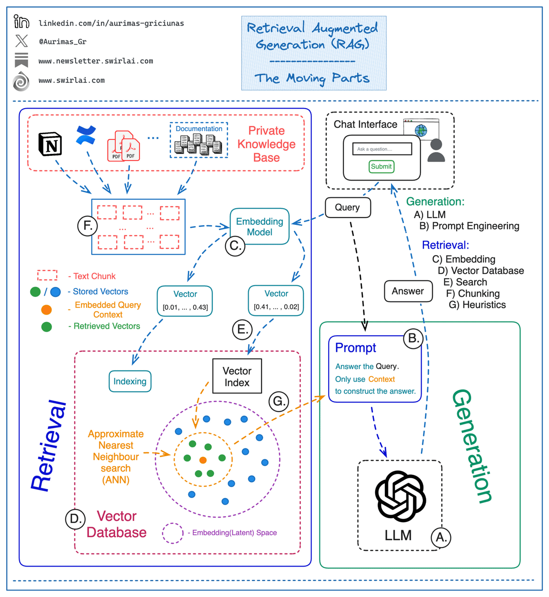

# ragaas

### components to build

#### Data pipeline

Takes ingestion of data, chunking and then storing the chunked data in redis

#### Embedding

Embedding model which can access the redis data and dump in qdrant after getting the embedding output this functions as a pipeline

#### Query Embedding

An endpoint to get the chat query and then get the embedding and then return the closest embedding output in natural language.

#### Prompt builder

Build the prompt with the context in mind and query the LLM and then get the answer and return it to the chat interface

## Architecture for a RAG
[Source](https://www.linkedin.com/posts/aurimas-griciunas_llm-genai-llmops-activity-7176868725923430400-tO__?utm_source=share&utm_medium=member_desktop)

